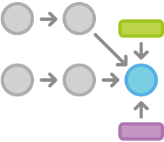

##git branch

Branching is the safe and efficient way to test out new code (or ideas!) on top of existing, working code without breaking anything.  When combined with GitHub, it also offers a very robust, collaborative design and development framework.  

To get started, navigate to your local copy of `teaching-materials` and type

```Bash
git branch
```

Unless you already created a branch, you should see something like this:

```Bash
git branch
* master
```

There is only one branch, the default branch, and by convention it is called 'master'.  The master branch is a straight path, with each step in the path corresponding to a *commit*.  If we stand at the newest commit, that is where the `HEAD` of the master branch is.  


Now we can create another branch, to try adding new functionality or just to experiment with.  To create a new branch, we type
```Bash
git branch <branch_name>
```

Now type `git branch` again and the output should have your new branch listed.
```Bash
git branch
  gil
* master
```

The asterisk denotes which branch we are currently standing on.  So we have created the new branch, but we are still standing on master.  To move to the new branch, we have to check it out with

`git checkout <branch_name>`

git will tell us when we switch branches

```Bash
git checkout gil
Switched to branch 'gil'
```

and we can also check with `git branch`

```Bash
git branch
* gil
  master
```

Now, any changes we make will not appear in master, but on the new branch.  We have created a new path, but both paths will share a common "step" which is the last commit we make before we create the branch.


When we make a commit, the branch we stand on will advance by one step, while the other branches will remain static.  

###Merging

Once we are satisfied that the new feature on our new branch works well, we can `merge` it into master.  This will take the second path we created with the `git branch` command and make it rejoin master.



To perform a merge, first `git checkout` the branch you want to merge *into*.  Since we will merge into `master` we

```Bash
git checkout master
Switched to branch 'master'
```

To merge the changes from the new branch, use

```Bash
git merge <branch_name>
```

[Learn git branching](http://pcottle.github.io/learnGitBranching/)
